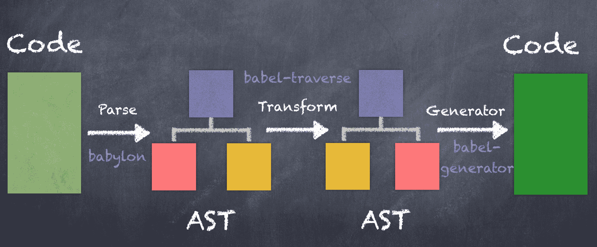
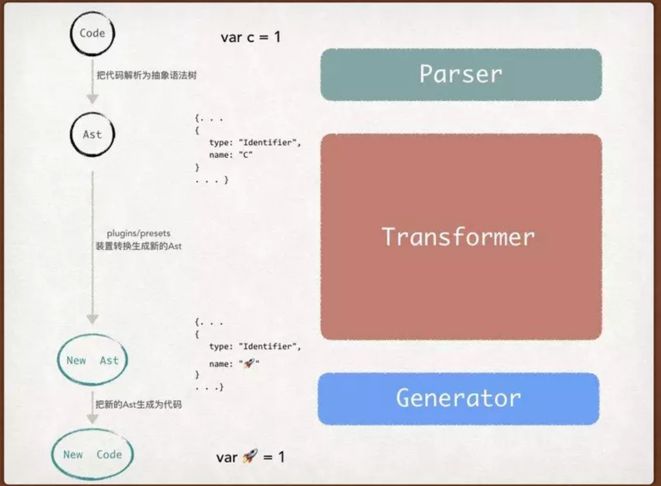

## Babel

### babel包结构

#### 核心包
- babel‑core：babel转译器本身，提供了babel的转译API，如babel.transform等，用于对代码进行转译。像webpack的babel‑loader
就是调用这些API来完成转译过程的。
- babylon：js的词法解析器
- babel‑traverse：用于对AST（抽象语法树，想了解的请自行查询编译原理）的遍历，主要给plugin用
- babel‑generator：根据AST生成代码
#### 功能包
- babel‑types：用于检验、构建和改变AST树的节点
- babel‑template：辅助函数，用于从字符串形式的代码来构建AST树节点
- babel‑helpers：一系列预制的babel‑template函数，用于提供给一些plugins使用
- babel‑code‑frames：用于生成错误信息，打印出错误点源代码帧以及指出出错位置
- babel‑plugin‑xxx：babel转译过程中使用到的插件，其中babel‑plugin‑transform‑xxx是transform步骤使用的
- babel‑preset‑xxx：transform阶段使用到的一系列的plugin,如果说 plugin 是处理代码的规则，那么 preset 就是一组规则的集合。你完全可以自己拼装不同的插件，生成一个新的预设。
- babel‑polyfill：JS标准新增的原生对象和API的shim，实现上仅仅是 **core‑j** 和 **regenerator‑runtime** 两个包的封装
- babel‑runtime：功能类似babel‑polyfill，一般用于library或plugin中，因为它不会污染全局作用域
#### 工具包
- babel‑cli：babel的命令行工具，通过命令行对js代码进行转译
- babel‑register：通过绑定node.js的require来自动转译require引用的js代码文件

### babel基本工作原理

#### 概念

babel是一个转译器，感觉相对于编译器compiler，叫转译器transpiler更准确，因为它只是把同种语言的高版本规则翻译成低版本规则，而不像编译器那样，输出的是另一种更低级的语言代码。但是和编译器类似，babel的转译过程也分为三个阶段：parsing、transforming、generating。

#### 具体过程

> 以ES6代码转译为ES5代码为例

ES6代码输入 ==》 babylon进行解析 ==》 得到AST
==》 plugin用babel‑traverse对AST树进行遍历转译 ==》 得到新的AST树
==》 用babel‑generator通过AST树生成ES5代码

1. 解析

    解析步骤接收代码并输出 AST。 这个步骤分为两个阶段：词法分析（Lexical Analysis） 和 语法分析（Syntactic Analysis）。@babel/parser,Babel 使用的解析器是 babylon。Google 公司的Traceur转码器，也可以将 ES6 代码转为 ES5 代码。

2. 转换

    转换步骤接收 AST 并对其进行遍历，在此过程中对节点进行添加、更新及移除等操作。 这是 Babel 或是其他编译器中最复杂的过程。同时也是插件将要介入工作的部分。
    Babel提供了@babel/traverse(遍历)方法维护这AST树的整体状态，并且可完成对其的替换，删除或者增加节点，这个方法的参数为原始AST和自定义的转换规则，返回结果为转换后的AST。

3. 生成

    代码生成步骤把最终（经过一系列转换之后）的 AST 转换成字符串形式的代码，同时还会创建源码映射（source maps）。
    代码生成其实很简单：深度优先遍历整个 AST，然后构建可以表示转换后代码的字符串。
    Babel使用 @babel/generator 将修改后的 AST 转换成代码，生成过程可以对是否压缩以及是否删除注释等进行配置，并且支持 sourceMap。

Babel的运行原理图示A

Babel的运行原理图示B

#### 注意

babel只是转译新标准引入的句法（syntax），比如ES的箭头函数转译成ES的函数；而新标准引入的新的原
生对象，部分原生对象新增的原型方法，新增的API等（如Proxy、Set等），这些babel是不会转译的。需要用户自行引入polyfill来解决（babel-polyfill）

### 更多尝试与实践
- 无痕埋点：通过 Babel 插件注入打点代码通过给函数名做标记的方式或其他方式，随时获取过去一段时间内的埋点信息。
- 错误日志收集：直接注入源代码的信息，尽可能收集更加准确和详细的错误信息。
- 无论你的代码是 ES2015、JSX、TypeScript 或疯狂的自定义功能 - 编译器都知道该怎么做。