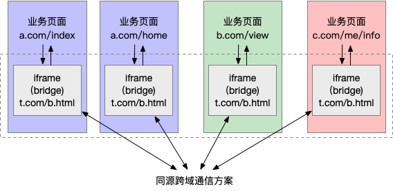

# web通信(web messaging)
> 需在服务器环境下运行
## 1. 分类
- 跨文档通信（cross-document messaging）
    - 跨文档通信就是我们国内更为熟知的HTML5 window.postMessage()应用的那种通信;
- 通道通信（MessageChannel）
    - 伴随着server-sent事件以及web sockets(???)

## 2. 总结
跨文档通信(cross-document messaging)、通道通信(channel messaging)、服务器发送事件(server-sent events)或是网络套接字(web sockets)
跨文档通信和通道通信成为HTML5 通信接口“套件”中有用的一部分。

--- 

## 跨页面通信

>   在浏览器中，我们可以同时打开多个Tab页，每个Tab页可以粗略理解为一个“独立”的运行环境，
    即使是全局对象也不会在多个Tab间共享。
    然而有些时候，我们希望能在这些“独立”的Tab页面(或者同页面下的iframe框架)之间同步页面的数据、信息或状态。

### 同源页面
- **通信+共享存储+事件监听模式**
    - **BroadCast Channel**，创建一个用于广播的通信频道。当所有页面都监听同一频道的消息时，其中某一个页面通过它发送的消息就会被其他所有页面收到。
    - **Service Worker**，可以长期运行在后台的 Worker，能够实现与页面的双向通信。多页面共享间的 Service Worker 可以共享，将 Service Worker 作为消息的处理中心（中央站）即可实现广播效果。
    - **WebStorage**，当 LocalStorage/~~SessionStorage~~ 变化时，会触发storage事件。利用这个特性，我们可以在发送消息时，把消息写入到某个 LocalStorage 中；然后在各个页面内，通过监听storage事件即可收到通知。但是由于sessionstorage 里面的数据在页面会话结束时会被清除，所以不支持跨标签页共享数据，但如果一个标签页包含多个iframe标签且他们属于同源页面，那么他们之间是可以共享sessionStorage的。
- **共享存储+长轮询的模式**，其他一些可以共享数据的方式也可用于页面通信，但是这些方式想实现跨页面通信时的问题在于，它无法主动通知所有页面，因此，我们需要使用轮询的方式，来拉取最新的数据。
    - **Shared Worker**，普通的 Worker 之间是独立运行、数据互不相通；而多个 Tab 注册的 Shared Worker 则可以实现数据共享。但它无法主动通知所有页面，因此，需要使用轮询的方式，来拉取最新的数据。
    > 注意，如果使用addEventListener来添加 Shared Worker 的消息监听，需要显式调用MessagePort.start方法，即上文中的sharedWorker.port.start()；如果使用onmessage绑定监听则不需要。

    - **IndexedDB/cookie**，使用其他一些“全局性”（支持跨页面）的共享存储数据方案。例如 IndexedDB 或 cookie。消息发送方将消息存至 IndexedDB 中；接收方（例如所有页面）则通过轮询去获取最新的信息。在这之前，我们先简单封装几个 IndexedDB 的工具方法。

> 也许你会认为长轮询没有监听模式优雅，但实际上，有些时候使用“共享存储”的形式时，不一定要搭配长轮询。例如，在多 Tab 场景下，我们可能会离开 Tab A 到另一个 Tab B 中操作；过了一会我们从 Tab B 切换回 Tab A 时，希望将之前在 Tab B 中的操作的信息同步回来。这时候，其实只用在 Tab A 中监听visibilitychange这样的事件，来做一次信息同步即可。
- **页面跳转的过程中携带信息**
    - **window.open + window.opener**，当我们使用window.open打开页面时，方法会返回一个被打开页面window的引用。而在未显示指定noopener时，被打开的页面可以通过window.opener获取到打开它的页面的引用 —— 通过这种方式我们就将这些页面建立起了联系（一种树形结构）。
    - **window . name**，设置 window.name = message
    当通过 window.location.href 或 \<a href='./index2.html'>index2.html\</a> 在当前窗口载入新页面时，window.name 仍保存着上个页面所设置的信息。

    - **url hash**，修改目标文档的 url，将想要传递的信息保存在 url 的 hash 字段中。

    - **window.history.replace() 和 document.referrer**，利用的是 window.history.replaceState() 修改 url，并不会使页面重新加载，所以趁机可以将信息存在 url 中（window.history.replaceState(window.history.state, document.title, 'messageFromIndex1')），document.referrer 会保存返回跳转或打开到当前页面的那个页面的 url，便可以从其中取到信息。

### 非同源页面

- **iframe “桥”**，可以使用一个用户不可见的 iframe 作为“桥”。由于 iframe 与父页面间可以通过指定origin来忽略同源限制，因此可以在每个页面中嵌入一个 iframe （例如：http://sample.com/bridge.html），而这些 iframe 由于使用的是一个 url，因此属于同源页面，其通信方式可以复用同原页面提到的各种通信方式。

--- 
 
## 依赖后端  (参看 Real-time-Notification-And-Delivery)
- session cookie(会话cookie)
- WebSocket
- http接口轮询(短轮询，Comet--基于长连接,基于stream流)
- server-sent-event